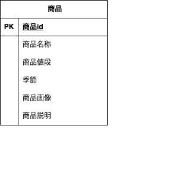

 mogitate

 概要（Overview）

テスト課題として作成した Laravel プロジェクトです。

環境構築

Dockerビルド
1. git clone git@github.com:Tatsu1438/mogitate.git
2. DockerDesktopアプリを立ち上げる
3. docker-compose up -d --build

mysql:

platform: linux/amd64   
image: mysql:8.0

environment:

    MYSQL_ROOT_PASSWORD: root
    MYSQL_DATABASE: laravel_db
    MYSQL_USER: laravel_user
    MYSQL_PASSWORD: laravel_pass
 
    .command:
      mysqld --default-authentication-plugin=mysql_native_password
    .volumes:
      - ./docker/mysql/data:/var/lib/mysql
      - ./docker/mysql/my.cnf:/etc/mysql/conf.d/my.cnf

 Laravel環境構築
 このプロジェクトは Docker を用いた Laravel 開発環境です。
 
  1. Docker-compose exec php bash 
  2. compose imstall
  3. 「.env.example」ファイルを 「.env」ファイルに命名を変更。または、新しく.envファイルを作成
  4. .envに以下の環境変数を追加

 environment:
 
      MYSQL_ROOT_PASSWORD: root
      MYSQL_DATABASE: laravel_db
      MYSQL_USER: laravel_user
      MYSQL_PASSWORD: laravel_pass

 アプリケーションキーの作成:
 
    php artisan key generate

 マイグレーションの実行:
  
    php artisan migrate

 シーディングの実行:
 
    php artisan db:seed

 使用技術（実行環境）

  ER図

 

 言語・フレームワーク
. PHP 7.4
. Laravel 8.75
. HTML / CSS

 データベース
. MySQL 8.0

 インフラ
. Docker / Docker Compose

 開発ツール
. VS Code
. phpMyAdmin
. Git / GitHub
. Composer
. Nginx

 アクセスURL
アプリ: http://localhost:8081

phpMyAdmin: http://localhost:8082

 
